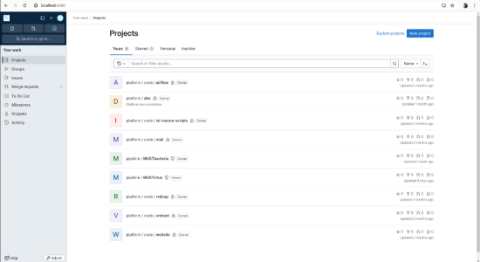

**                                         Dockerisation vm gitlab   
**


This document summarizes all the commands and steps required to dock a gitlab vm.

**STEP 1 :** Creating docker-compose

Then create a docker-compose.yml file in which to specify the specifications of the container gitlab has created so that it functions correctly. Here's how it looks:
```
# docker-compose.yml

services:
  web:
    image: gitlab/gitlab-ee:latest
    restart: always
    hostname: 'localhost'
    container_name: gitlab-ee
    environment:
      GITLAB_OMNIBUS_CONFIG: |
        external_url 'http://localhost'
    ports:
      - '8080:80'
      - '8443:443'
    volumes:
      - /srv/gitlab/config:/etc/gitlab
      - /srv/gitlab/logs:/var/log/gitlab
      - /srv/gitlab/data:/var/opt/gitlab
      # - ./srv/gitlab/backups:/var/opt/gitlab/backups
    networks:
      - gitlab
  gitlab-runner:
    image: gitlab/gitlab-runner:alpine
    container_name: gitlab-runner    
    restart: always
    depends_on:
      - web
    volumes:
      - /var/run/docker.sock:/var/run/docker.sock
      - '$GITLAB_HOME/gitlab-runner:/etc/gitlab-runner'
    networks:
      - gitlab

networks:
  gitlab:
    name: gitlab-network
```

Then launch the container:

```
docker-compose up –d
```

**STEP 3 :** Data backup from vm 

To do this, you need to connect to the vm using ssh. The user must then execute the following command: 
``` 
sudo gitlab-rake gitlab:backup:create
```

This will create a backup file in the `/var/opt/gitlab/backups/` directory of the vm, containing all files, databases and git repositories.

**STEP 4:** Transfer backup to Gitlab docker container host

To do this, use the scp command :
```
scp -r root@VMgitlab: /var/opt/gitlab/backups/file_gitlab_backup.tar /home/user/backup/filename_choose_gitlab_backup.tar
```

` `This command transfers a copy of the backup created in step 3 to the backup directory of the gitlab container host.

**STEP 5 :** Restore data in the Docker container

Copy the backup file contained in the container host to a docker backup volume:
```
sudo cp /home/user/backup/file_gitlab_backup.tar ./srv/gitlab/data/backups/
```


**STEP 6 :**  Finalizing dockerization

Once all these prerequisites have been met, the user must log on as root to the gitlab container created:
```
docker exec -it gitlab-ee /bin/bash
```

Next, it will need to start restoring the copied data to the `srv/gitlab/data/backups` volume of the container (without **gitlab_backup.tar** extension):
```
gitlab-backup restore BACKUP= backup_file_name
```

**STEP 7 :** Test 

Finally, the user must connect to a browser as localhost on port 8080. In this case, the interface should look like this:



